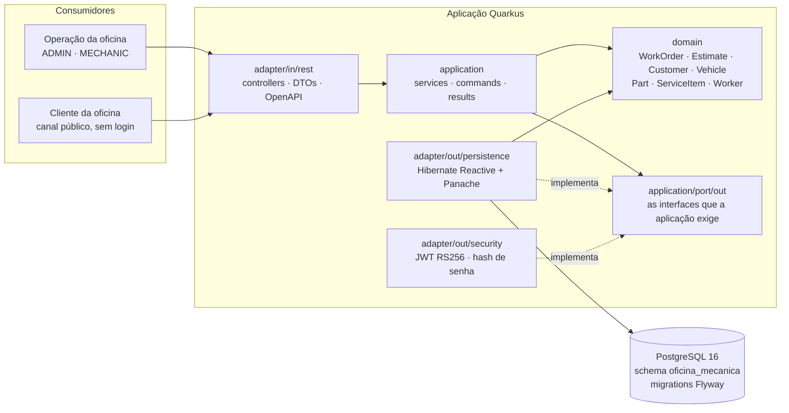
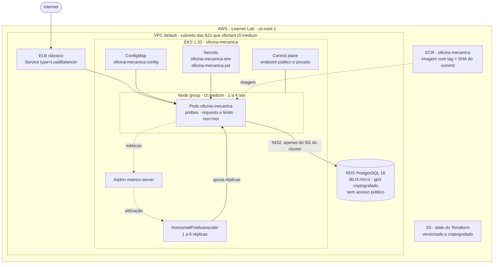
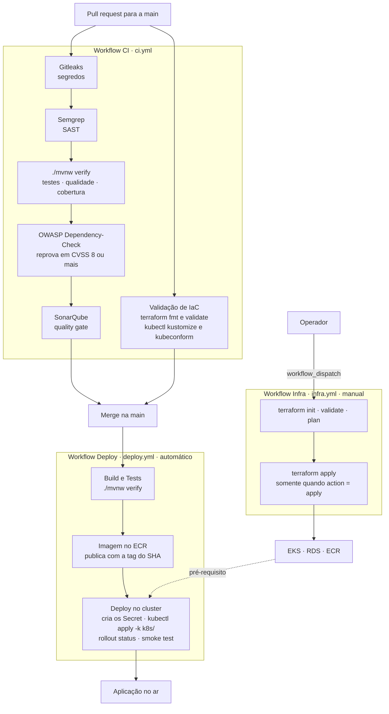

# Oficina Mecânica — Sistema Integrado de Atendimento e Execução de Serviços

Back-end do sistema de uma oficina mecânica — 16SOAT, Tech Challenge. Construído com
[Quarkus](https://quarkus.io/), aplica **Domain-Driven Design** sobre arquitetura hexagonal, expõe uma
**API REST documentada (Swagger)** e cobre a gestão de **ordens de serviço, clientes, veículos,
serviços, peças/insumos (com controle de estoque) e orçamentos**, além de um **canal público** para o
cliente acompanhar e autorizar o serviço.

A **Fase 2** tira a aplicação do Docker Compose e a coloca num **cluster EKS provisionado por
Terraform**, com **Postgres gerenciado no RDS**, exposição por **Load Balancer**, configuração em
`ConfigMap`, credenciais em `Secret`, **escalabilidade automática** por consumo de CPU e memória, e um
**caminho de entrega automatizado** que a cada merge na `main` constrói, publica, implanta e verifica.

---

## Sumário

- [A solução](#a-solução)
- [Arquitetura](#arquitetura)
  - [Componentes da aplicação](#componentes-da-aplicação)
  - [Infraestrutura provisionada](#infraestrutura-provisionada)
  - [Fluxo de deploy](#fluxo-de-deploy)
- [Recursos de nuvem criados](#recursos-de-nuvem-criados)
- [Executando localmente](#executando-localmente)
- [Provisionando a infraestrutura](#provisionando-a-infraestrutura)
- [Implantando no cluster](#implantando-no-cluster)
- [Escalabilidade automática](#escalabilidade-automática)
- [Migrations no start da aplicação](#migrations-no-start-da-aplicação)
- [Autenticação JWT](#autenticação-jwt)
- [Mapa de endpoints](#mapa-de-endpoints)
- [Ciclo de vida da Ordem de Serviço](#ciclo-de-vida-da-ordem-de-serviço)
- [Collection das APIs](#collection-das-apis)
- [Vídeo demonstrativo](#vídeo-demonstrativo)
- [Testes automatizados e cobertura](#testes-automatizados-e-cobertura)
- [Build](#build)
- [Análise estática e segurança](#análise-estática-e-segurança)
- [Documentação e decisões](#documentação-e-decisões)

---

## A solução

### O que o sistema faz

- **Ordem de Serviço (OS):** abertura, inclusão de serviços e de peças/insumos, **orçamento gerado
  automaticamente** (peças + mão de obra) e envio ao cliente para aprovação.
- **Acompanhamento:** ciclo de status `RECEIVED → DIAGNOSIS → WAITING_APPROVAL → APPROVED →
  IN_PROGRESS → COMPLETED → DELIVERED` (+ `CANCELLED`), com **transições automáticas** conforme as
  ações (gerar orçamento, aprovar/rejeitar, fechar).
- **Canal público do cliente:** consulta da OS e **aprovação/rejeição do orçamento** via API, sem login.
- **Gestão administrativa:** CRUD de clientes, veículos, serviços e peças; **controle de estoque**
  (baixa na aprovação, restauração no cancelamento, alerta de estoque mínimo).
- **Métrica:** tempo médio de execução das OS concluídas.
- **Segurança:** autenticação JWT (RS256) e RBAC nas APIs administrativas; validação de CPF/CNPJ e placa.

### Objetivos desta fase

| Objetivo | Como é atendido |
|---|---|
| Rodar em Kubernetes | Cluster EKS com `Deployment`, `Service`, `ConfigMap`, `Secret` e `HorizontalPodAutoscaler` em [`k8s/`](k8s/) |
| Infraestrutura como Código | Todo o ambiente nasce de um `terraform apply` em [`infra/terraform/`](infra/terraform/) |
| Banco de dados gerenciado | Postgres 16 no RDS, privado, alcançável apenas pelos nós do cluster |
| Escalabilidade automática | HPA de 1 a 6 réplicas por CPU e memória, alimentado pelo `metrics-server` |
| Entrega automatizada | Dois workflows do GitHub Actions: provisionamento manual e entrega a cada merge |
| Reprodutibilidade | Este README e o [`infra/README.md`](infra/README.md) levam do zero ao ambiente no ar |

### Tecnologias

| Camada | Tecnologia |
|---|---|
| Runtime | Java 21 + Quarkus 3.32.3 |
| Persistência | Hibernate Reactive + Panache + PostgreSQL 16 |
| Migrations | Flyway |
| Segurança | SmallRye JWT (RS256) + RBAC |
| Documentação | SmallRye OpenAPI / Swagger UI |
| Observabilidade | SmallRye Health + OpenTelemetry + Micrometer/Prometheus |
| Mapeamento | MapStruct |
| Testes | JUnit 5, Mockito, REST-assured, Testcontainers |
| Container | Docker (build multistage, runtime UBI9 non-root) |
| Orquestração | Kubernetes 1.33 (Amazon EKS) |
| IaC | Terraform >= 1.10, provider AWS ~> 6.0, state no S3 |
| CI/CD | GitHub Actions |

---

## Arquitetura

### Componentes da aplicação

O código é organizado por **bounded context** e, dentro de cada um, por camada hexagonal: o domínio
não conhece ninguém, a aplicação declara as portas de que precisa, e os adapters as implementam.



As setas cheias são dependência em tempo de compilação; as pontilhadas, implementação. Note que
nenhuma sai do `domain`: é isso que o mantém livre de framework e testável sem infraestrutura.

Contextos: `auth`, `customer`, `part`, `servicecatalog`, `vehicle`, `worker`, `workorder`, mais o
`shared` com os utilitários transversais. As regras de dependência entre camadas não são convenção de
revisão: são verificadas por testes de arquitetura a cada build.

### Infraestrutura provisionada

Tudo dentro da moldura `AWS` nasce do Terraform, exceto a VPC, as subnets e as roles IAM — a conta é
do **AWS Academy (Learner Lab)**, que não concede `iam:CreateRole` e já entrega rede e roles prontas
([ADR-0001](docs/adr/0001-eks-provisionado-com-roles-do-lab-na-vpc-default.md)).



O detalhe de cada recurso, das restrições da conta e do que fazer quando o lab é reiniciado está em
[`infra/README.md`](infra/README.md).

### Fluxo de deploy

Três workflows cobrem o caminho do código, com responsabilidades separadas: qualidade no pull
request, provisionamento por disparo manual e entrega no merge. A divisão está registrada em
[ADR-0003](docs/adr/0003-pipeline-dividida-entre-provisionamento-e-entrega.md). Um quarto,
`pr-title-lint.yml`, fica fora do desenho porque não toca em build nem em ambiente: só valida o
título do pull request contra Conventional Commits.



A etapa que falha interrompe a entrega: teste vermelho não gera imagem, e imagem que não publicou não
chega ao cluster. O último passo é o **smoke test**, que autentica, abre uma ordem de serviço e a
recupera na listagem contra o endereço público — se ele passa, o ELB, o pod, o `ConfigMap`, os dois
`Secret`, a conectividade com o RDS e as migrations estão todos de pé.

---

## Recursos de nuvem criados

Todos nascem e morrem com o Terraform de [`infra/terraform/`](infra/terraform/).

| Recurso | Tipo | O que é |
|---|---|---|
| `oficina-mecanica` | `aws_ecr_repository` | Registry da imagem da aplicação, com scan on push |
| — | `aws_ecr_lifecycle_policy` | Expira imagens além das 10 mais recentes |
| `oficina-mecanica` | `aws_eks_cluster` | Control plane do Kubernetes 1.33, endpoint público e privado |
| `oficina-mecanica-nodes` | `aws_eks_node_group` | Nós gerenciados `t3.medium` (AL2023), de 2 a 4 instâncias |
| `metrics-server` | `aws_eks_addon` | Fonte de métricas de recurso, sem a qual o HPA não escala |
| `oficina-mecanica-db` | `aws_db_instance` | Postgres 16 em `db.t3.micro`, disco gp3 criptografado, sem acesso público |
| `oficina-mecanica-db` | `aws_db_subnet_group` | Subnets onde a instância pode nascer |
| `oficina-mecanica-db` | `aws_security_group` | Fecha o banco; a única entrada é a regra abaixo |
| — | `aws_vpc_security_group_ingress_rule` | Libera a porta 5432 só para o security group dos nós do cluster |
| — | `random_password` | Senha do banco, gerada no apply e nunca versionada |

Criados fora do `terraform apply`:

| Recurso | Origem |
|---|---|
| Bucket S3 do state | `infra/scripts/bootstrap-tf-state.sh` — o backend precisa existir antes do primeiro `init` |
| ELB clássico | Materializado pelo EKS a partir do `Service type=LoadBalancer`; não está no state |

Não criados, por escolha ou por restrição da conta:

| Recurso | Origem |
|---|---|
| VPC default e subnets | Já existem na conta; resolvidos por data source |
| `*-LabEksClusterRole-*`, `*-LabEksNodeRole-*` | Provisionadas pela stack do lab; resolvidas por `name_regex` |

---

## Executando localmente

### Um único comando

Pré-requisito: **Docker + Docker Compose**. Nada mais — nem Java, nem Maven, nem `.env`.

```shell
docker compose up
```

O Compose **constrói a aplicação a partir do código-fonte** (build multistage, dentro do próprio
Docker) e sobe **aplicação + PostgreSQL** já configurados. Na primeira execução o build baixa as
dependências e leva alguns minutos; nas próximas é quase instantâneo (cache).

- API: `http://localhost:8080`
- Swagger UI: `http://localhost:8080/q/swagger-ui`
- Login: **`admin` / `admin123`** (ver [Autenticação JWT](#autenticação-jwt))

| Ação | Comando |
|---|---|
| Subir em segundo plano | `docker compose up -d` |
| Acompanhar os logs | `docker compose logs -f app` |
| Derrubar | `docker compose down` |
| Derrubar e apagar o banco | `docker compose down -v` |

O `.env` é **opcional**: todos os valores já vêm preenchidos no `docker-compose.yml`. Crie um `.env` (a
partir de `.env.example`) **somente** se quiser sobrescrever portas, senhas ou nomes padrão.

| Variável | Descrição | Padrão |
|---|---|---|
| `INFRA_HOST_POSTGRES` | Host do PostgreSQL | `localhost` |
| `POSTGRES_DB` | Nome do **banco** | `oficina` |
| `POSTGRES_USERNAME` | Usuário do banco | `admin` |
| `POSTGRES_PASSWORD` | Senha do banco | `admin` |
| `APP_SEED_ADMIN_USERNAME` / `APP_SEED_ADMIN_PASSWORD` | Admin inicial | `admin` / `admin123` |
| `APP_SEED_MECHANIC_USERNAME` / `APP_SEED_MECHANIC_PASSWORD` | Mecânico inicial | `mecanico` / `mecanico123` |
| `JWT_EXPIRATION_HOURS` | Validade do token (horas) | `8` |
| `JWT_PRIVATE_KEY_LOCATION` | Chave privada de assinatura RS256 | `.local-jwt/privateKey.pem` |
| `JWT_PUBLIC_KEY_LOCATION` | Chave pública de validação RS256 | `.local-jwt/publicKey.pem` |

> **Banco x Schema:** o **banco** chama-se `oficina` e a aplicação cria/usa o **schema**
> `oficina_mecanica` automaticamente na inicialização (Flyway). Não confunda os dois.
>
> **Senhas de seed:** via `docker compose` já vêm preenchidas (`admin123` / `mecanico123`). Se você
> rodar fora do Compose com `APP_SEED_*_PASSWORD` em branco, a aplicação **gera uma senha aleatória**
> no primeiro boot e a imprime no log com o prefixo `[SEED]`.

O par de chaves RS256 é gerado na primeira subida pelo serviço `jwt-keys` e guardado num volume do
Docker — a imagem não carrega chave alguma (ver [Chaves JWT (RS256)](#chaves-jwt-rs256)).

### Dev mode (live reload)

Requer Java 21 + Maven. Sobe só o banco em container e a aplicação localmente com hot reload:

```shell
infra/scripts/generate-jwt-pair.sh    # uma única vez: cria .local-jwt/
docker compose up -d postgres
./mvnw quarkus:dev
```

- API em `http://localhost:8080` (live reload) · Dev UI em `http://localhost:8080/q/dev/`.

### Verificando por fora

O mesmo smoke test da pipeline roda contra o ambiente local:

```shell
export APP_SEED_ADMIN_PASSWORD=admin123
infra/scripts/smoke-test.sh http://localhost:8080
```

---

## Provisionando a infraestrutura

Pré-requisitos: `terraform >= 1.10`, `aws` CLI, `kubectl` e uma sessão ativa do Learner Lab
(`AWS_ACCESS_KEY_ID`, `AWS_SECRET_ACCESS_KEY`, `AWS_SESSION_TOKEN`).

```bash
# 1. Uma vez por conta: cria o bucket de state. Em outra conta, ajuste o nome do
#    bucket no bloco backend de infra/terraform/versions.tf antes de rodar.
infra/scripts/bootstrap-tf-state.sh

# 2. Confere o que a conta autoriza. Rode de novo depois de cada reset do lab:
#    IDs de rede e nomes de role mudam junto.
infra/scripts/verify-lab.sh infra/scripts/lab-capabilities.md

# 3. Cria o cluster, o banco e o registry. Leva de 15 a 20 minutos.
terraform -chdir=infra/terraform init
terraform -chdir=infra/terraform apply

# 4. Acesso ao cluster, direto das saídas do Terraform.
$(terraform -chdir=infra/terraform output -raw kubeconfig_command)
kubectl get nodes
```

Ao fim de cada sessão longa, `terraform -chdir=infra/terraform destroy` devolve o crédito do lab. Se
houver um `Service type=LoadBalancer` no cluster, apague-o com `kubectl` **antes** do destroy, ou o ELB
fica órfão na conta — ele não está no state.

O mesmo Terraform também roda pelo GitHub Actions, no workflow **Workflow Infra**
(`.github/workflows/infra.yml`), com disparo **manual** e as ações `plan` (default) e `apply`. Nenhum
merge inicia vinte minutos de convergência de control plane por acidente.

Os comandos acima valem para qualquer conta. Região, nome do projeto, versão do cluster, tamanho do
node group e classe do banco são **variáveis** do Terraform, todas com default — `aws_region` é
`us-east-1`. Para provisionar em outra região, passe `-var aws_region=...` ou ajuste o default, e
confira antes quais AZs daquela região ofertam a instância dos nós, porque é esse filtro que decide
as subnets. O que está fixo no código e precisa ser editado à mão numa conta nova são três valores: o
nome do bucket no bloco `backend` de `versions.tf` e os dois da tabela em
[Implantando no cluster](#implantando-no-cluster).

Variáveis, saídas, o que fazer quando o lab é reiniciado e como acessar o banco criado:
[`infra/README.md`](infra/README.md).

---

## Implantando no cluster

Os manifestos vivem em [`k8s/`](k8s/), fora de `infra/`, porque é onde o enunciado da fase os exige.

| Objeto | Arquivo | O que carrega |
|---|---|---|
| `ConfigMap` `oficina-mecanica-config` | `k8s/configmap.yaml` | Host e nome do banco, modo TLS, porta, issuer e expiração do JWT, caminho das chaves, usuários de seed, flag do Swagger |
| `Secret` `oficina-mecanica-env` | criado por script | Usuário e senha do banco, senhas de seed |
| `Secret` `oficina-mecanica-jwt` | criado por script | O par RS256, montado como arquivo em `/etc/jwt` |
| `Deployment` `oficina-mecanica` | `k8s/deployment.yaml` | Probes, requests e limits, container non-root; o número de réplicas é do HPA |
| `Service` `oficina-mecanica` | `k8s/service.yaml` | `LoadBalancer`, que o EKS materializa como ELB clássico |
| `HorizontalPodAutoscaler` `oficina-mecanica` | `k8s/hpa.yaml` | De 1 a 6 réplicas, por CPU e memória |

Os dois `Secret` **não** estão em `k8s/` de propósito: senha do banco, credenciais de seed e chave
privada não entram no repositório.

Numa conta nova, dois valores dos manifestos dependem do apply e precisam bater com o que o Terraform
produziu:

| Onde | Chave | De onde vem |
|---|---|---|
| `k8s/configmap.yaml` | `INFRA_HOST_POSTGRES` | `terraform -chdir=infra/terraform output -raw database_host` |
| `k8s/kustomization.yaml` | `images[0].newName` | `terraform -chdir=infra/terraform output -raw ecr_repository_url` |

### Da máquina do operador

```bash
# Uma vez: gera o par RS256 fora do build da imagem.
infra/scripts/generate-jwt-pair.sh

export APP_SEED_ADMIN_PASSWORD=... APP_SEED_MECHANIC_PASSWORD=...
infra/scripts/create-app-credentials.sh

infra/scripts/publish-image.sh
kubectl apply -k k8s/
# A tag versionada é `latest`, então o apply sozinho não muda o pod: é o restart
# que faz o Kubernetes buscar a imagem recém-publicada.
kubectl rollout restart deploy/oficina-mecanica
kubectl rollout status deploy/oficina-mecanica

# Prova de que funcionou, de fora para dentro.
infra/scripts/smoke-test.sh
```

O endereço público sai do `Service`; o ELB leva cerca de um minuto para começar a responder:

```bash
ELB="$(kubectl get svc oficina-mecanica -o jsonpath='{.status.loadBalancer.ingress[0].hostname}')"
curl "http://$ELB/q/health/ready"
```

### Pelo caminho de entrega

O mesmo deploy acima, sem passo manual: o workflow **Workflow Deploy**
(`.github/workflows/deploy.yml`) roda a cada merge na `main`. A tag da imagem é o SHA do commit, e é
ela que faz do `kubectl apply` um rollout de verdade — com `latest`, o objeto no cluster não mudaria e
nenhum pod seria substituído.

O acesso ao cluster **não usa credencial da AWS**: a sessão do Learner Lab expira em cerca de quatro
horas e o deploy ficaria vermelho por motivo alheio ao código. Ele autentica com o token de uma
`ServiceAccount` dedicada, criada uma vez por cluster por
`infra/scripts/create-deploy-kubeconfig.sh`
([ADR-0002](docs/adr/0002-deploy-no-cluster-via-kubeconfig-de-serviceaccount.md)).

Habilitar a pipeline num cluster novo é gravar os secrets do repositório:

| Secret | De onde vem |
|---|---|
| `KUBE_CONFIG_B64` | `infra/scripts/create-deploy-kubeconfig.sh` |
| `POSTGRES_USERNAME` / `POSTGRES_PASSWORD` | `terraform output -raw database_username` / `database_password` |
| `APP_SEED_ADMIN_PASSWORD` / `APP_SEED_MECHANIC_PASSWORD` | Escolhidas pelo operador; são as credenciais de acesso à API |
| `JWT_PRIVATE_KEY_B64` / `JWT_PUBLIC_KEY_B64` | `infra/scripts/generate-jwt-pair.sh` |
| `AWS_ACCESS_KEY_ID`, `AWS_SECRET_ACCESS_KEY`, `AWS_SESSION_TOKEN` | Painel *AWS Details* do lab; só o job da imagem os usa |

---

## Escalabilidade automática

A aplicação ganha réplicas quando a carga sobe e as devolve quando a carga cai, sem intervenção. Quem
decide é o `HorizontalPodAutoscaler`, que compara o consumo dos pods com os `requests` declarados no
`Deployment` — daí a exigência de declará-los.

| Ajuste | Valor |
|---|---|
| Réplicas | de 1 a 6 |
| CPU | 60% do request de 250m |
| Memória | 80% do request de 512Mi |
| Subida | imediata, até 2 pods a cada 15s |
| Descida | 1 pod a cada 30s, após 1 min de calmaria |

A fonte das métricas é o `metrics-server`, instalado pelo Terraform como addon gerenciado do EKS. Um
cluster nasce sem ele, e sem ele o HPA lê `<unknown>` e nunca escala.

Para reproduzir a demonstração, dois terminais — um observando `kubectl get hpa,pods -w` e outro
gerando carga com `infra/scripts/load-test.sh`, uma rajada de logins (o endpoint mais caro em CPU da
API). O roteiro completo, com os números da medição de referência, está em
[`infra/README.md`](infra/README.md#escalabilidade-automática).

---

## Migrations no start da aplicação

As migrations do Flyway rodam na **inicialização da aplicação** (`quarkus.flyway.migrate-at-start:
true`), e não num `Job` do Kubernetes dedicado. A escolha é deliberada:

- **O rollout já é o ponto de sincronização.** Um pod só passa a readiness depois de migrar o banco,
  então `kubectl rollout status` — o passo que a pipeline já executa e no qual já espera — é
  exatamente a garantia de que o schema está na frente do tráfego. Um `Job` separado exigiria um
  segundo ponto de espera para provar a mesma coisa.
- **Não há corrida no primeiro deploy.** O HPA parte de `minReplicas: 1`, então o primeiro rollout
  converge com uma única instância migrando contra um banco vazio.
- **Os deploys seguintes são cobertos pelo lock do Flyway.** A tabela de histórico é travada durante a
  migração, de modo que réplicas simultâneas não aplicam o mesmo script duas vezes: as demais esperam
  e seguem.
- **Custo em prazo.** A alternativa do `Job` foi considerada e rejeitada pelo custo de implantá-la e
  observá-la dentro do prazo da fase, sem benefício em cima das três razões acima.

O trade-off aceito: uma migration longa atrasa a readiness do pod, e uma migration incompatível com a
imagem anterior quebraria um rollout com réplicas coexistindo. Ambos são conhecidos e toleráveis no
tamanho atual do schema.

É também assim que o requisito de "deploy do banco de dados" é atendido: o RDS nasce no workflow de
provisionamento e o schema é aplicado pelo Flyway no de entrega
([ADR-0003](docs/adr/0003-pipeline-dividida-entre-provisionamento-e-entrega.md)).

---

## Autenticação JWT

As APIs administrativas usam **Bearer JWT (RS256)**: login → token → header `Authorization`.

| Usuário | Role | Senha (com `.env.example`) |
|---|---|---|
| `admin` | `ADMIN` | `admin123` |
| `mecanico` | `MECHANIC` | `mecanico123` |

### 1. Login

```shell
curl -s -X POST http://localhost:8080/v1/auth/login \
  -H "Content-Type: application/json" \
  -d '{"username":"admin","password":"admin123"}'
```

Resposta:

```json
{ "token": "eyJraWQiOiJ...", "username": "admin", "role": "ADMIN", "expiresIn": 28800 }
```

### 2. Usando o token

```shell
TOKEN="eyJraWQiOiJ..."
curl -s http://localhost:8080/v1/customer -H "Authorization: Bearer $TOKEN"
```

### 3. Pelo Swagger UI

Abra `http://localhost:8080/q/swagger-ui` → **Authorize** (esquema `bearerAuth`) → cole **apenas o
token** (sem `Bearer`) → as chamadas passam a enviar o header automaticamente.

> Sem senha definida no `.env`? Recupere a gerada no log:
> `docker compose logs app | grep SEED`

### Chaves JWT (RS256)

O token é assinado com RSA. **A imagem não contém chave privada e o repositório não versiona nenhuma
chave:** o par é gerado uma única vez, fora do build, e informado à aplicação por
`JWT_PRIVATE_KEY_LOCATION` / `JWT_PUBLIC_KEY_LOCATION`. Assim a mesma imagem serve para qualquer
ambiente e um rebuild não invalida os tokens em circulação.

| Ambiente | Origem do par |
|---|---|
| `docker compose` | Serviço `jwt-keys` gera na primeira subida e guarda no volume `jwt_keys`, montado em `/etc/jwt` |
| Dev mode e uso local | `infra/scripts/generate-jwt-pair.sh` cria `.local-jwt/` (fora do controle de versão) |
| Testes de integração | Par efêmero gerado por `JwtKeyPairTestResource` em `target/jwt-test/` |
| Cluster | `Secret` `oficina-mecanica-jwt`, montado em `/etc/jwt`, criado pelo caminho de entrega |

Para gerar o par de um ambiente real e guardá-lo nos secrets do repositório:

```shell
infra/scripts/generate-jwt-pair.sh /caminho/seguro/jwt
gh secret set JWT_PRIVATE_KEY_B64 --body "$(base64 < /caminho/seguro/jwt/privateKey.pem | tr -d '\n')"
gh secret set JWT_PUBLIC_KEY_B64  --body "$(base64 < /caminho/seguro/jwt/publicKey.pem  | tr -d '\n')"
```

Guarde a chave privada apenas no gerenciador de secrets — nunca no repositório, no `.env` versionado
ou na imagem. Regerar o par invalida todos os tokens já emitidos, então trate-o como rotação
planejada. Sem `JWT_PRIVATE_KEY_LOCATION` definido, o `JwtKeyStartupGuard` **bloqueia a inicialização
em produção**, para que nenhum ambiente produtivo suba com a chave de desenvolvimento.

---

## Mapa de endpoints

Base local: `http://localhost:8080`. No cluster, o hostname do ELB. Papéis: 🔓 público ·
🔧 ADMIN+MECHANIC · 🛡️ ADMIN.

> **Modelo de acesso (segregação de funções):** os **cadastros/dados-mestre** (clientes, veículos,
> serviços, peças e workers) são **escritos apenas pelo ADMIN**; o MECHANIC pode **consultá-los**
> (GET) mas não criar/editar/excluir. As **Ordens de Serviço** (abrir, mudar status, lançar serviço,
> orçamento, fechar) são operadas por **ADMIN e MECHANIC**. O ADMIN é superusuário (faz tudo).

### Autenticação — `/v1/auth`
| Método | Path | Acesso |
|---|---|---|
| POST | `/v1/auth/login` | 🔓 |

### Clientes — `/v1/customer`
| Método | Path | Acesso |
|---|---|---|
| GET | `/v1/customer` | 🔧 |
| GET | `/v1/customer/{id}` | 🔧 |
| GET | `/v1/customer/by-document/{document}` | 🔧 |
| POST | `/v1/customer` | 🛡️ |
| PUT | `/v1/customer/{id}` | 🛡️ |
| DELETE | `/v1/customer/{id}` | 🛡️ |

### Veículos — `/v1/vehicle`
| Método | Path | Acesso |
|---|---|---|
| GET | `/v1/vehicle` (filtros: `license_plate`, `manufacturer`, `model`) | 🔧 |
| GET | `/v1/vehicle/{id}` | 🔧 |
| GET | `/v1/vehicle/by-license-plate/{license_plate}` | 🔧 |
| POST | `/v1/vehicle` | 🛡️ |
| PUT | `/v1/vehicle/{id}` | 🛡️ |
| DELETE | `/v1/vehicle/{id}` | 🛡️ |

### Trabalhadores — `/v1/worker`
| Método | Path | Acesso |
|---|---|---|
| GET | `/v1/worker` · `/v1/worker/{id}` | 🛡️ |
| POST | `/v1/worker` | 🛡️ |
| POST | `/v1/worker/login` | 🔓 |
| PUT | `/v1/worker/{id}` | 🛡️ |
| DELETE | `/v1/worker/{id}` | 🛡️ |

### Catálogo de serviços — `/admin/services`
| Método | Path | Acesso |
|---|---|---|
| GET | `/admin/services` · `/admin/services/{id}` | 🔧 |
| POST | `/admin/services` | 🛡️ |
| PUT | `/admin/services/{id}` | 🛡️ |
| DELETE | `/admin/services/{id}` | 🛡️ |

### Peças e insumos — `/admin/parts`
| Método | Path | Acesso |
|---|---|---|
| GET | `/admin/parts` · `/admin/parts/{id}` · `/admin/parts/low-stock` | 🔧 |
| POST | `/admin/parts` | 🛡️ |
| PUT | `/admin/parts/{id}` | 🛡️ |
| PATCH | `/admin/parts/{id}/stock?adjustment=±N` | 🛡️ |
| DELETE | `/admin/parts/{id}` | 🛡️ |

### Ordens de serviço — `/v1/work-orders`
| Método | Path | Acesso |
|---|---|---|
| GET | `/v1/work-orders` (`q`, `page`, `size`) | 🔧 |
| GET | `/v1/work-orders/{id}` | 🔧 |
| GET | `/v1/work-orders/metrics/average-execution-time` | 🛡️ |
| POST | `/v1/work-orders` | 🔧 |
| POST | `/v1/work-orders/{id}/services` | 🔧 |
| POST | `/v1/work-orders/{id}/estimate` | 🔧 |
| PATCH | `/v1/work-orders/{id}/status` | 🔧 |
| PATCH | `/v1/work-orders/{id}/estimate/{estimateId}/approve` | 🔧 |
| PATCH | `/v1/work-orders/{id}/estimate/{estimateId}/reject` | 🔧 |
| PATCH | `/v1/work-orders/{id}/close` | 🔧 |

### Canal público do cliente — `/v1/public/work-orders`
| Método | Path | Acesso |
|---|---|---|
| GET | `/v1/public/work-orders/{id}` | 🔓 |
| PATCH | `/v1/public/work-orders/{id}/estimate/{estimateId}/approve` | 🔓 |
| PATCH | `/v1/public/work-orders/{id}/estimate/{estimateId}/reject` | 🔓 |

### Operação — `/q`
| Método | Path | Acesso |
|---|---|---|
| GET | `/q/health/live` · `/q/health/ready` · `/q/health/started` | 🔓 |
| GET | `/q/openapi` · `/q/swagger-ui` | 🔓 |

---

## Ciclo de vida da Ordem de Serviço

```
RECEIVED ─► DIAGNOSIS ─► WAITING_APPROVAL ─► APPROVED ─► IN_PROGRESS ─► COMPLETED ─► DELIVERED
                                   │
                                   └─(rejeição)─► DIAGNOSIS     (qualquer não-terminal) ─► CANCELLED
```

- A OS nasce em **`RECEIVED`** (status definido automaticamente na criação).
- Gerar o orçamento move `DIAGNOSIS → WAITING_APPROVAL`; aprovar move `→ APPROVED` (e dá baixa no
  estoque); rejeitar volta para `DIAGNOSIS`.
- `COMPLETED` só via `PATCH /{id}/close` (exige OS `IN_PROGRESS` e orçamento aprovado).
- `CANCELLED` em `APPROVED` restaura o estoque reservado. OS `DELIVERED`/`CANCELLED` ficam bloqueadas.

Detalhes em [WORKORDER.md](WORKORDER.md).

---

## Collection das APIs

**[`postman/Oficina-Mecanica-E2E.postman_collection.json`](postman/Oficina-Mecanica-E2E.postman_collection.json)**
— 38 endpoints em 10 pastas, em ordem executável (auth → CRUDs → ciclo completo da OS → canal público
→ segurança). É auto-contida: gera tokens, CPFs e placas válidos dinamicamente. Instruções de uso em
[postman/README.md](postman/README.md).

Aponte a variável `base_url` para o ambiente que quer exercitar — `http://localhost:8080` no local, ou
o hostname do ELB no cluster:

```shell
kubectl get svc oficina-mecanica -o jsonpath='{.status.loadBalancer.ingress[0].hostname}'
```

Newman via Docker, contra o ambiente do Compose no ar — o container entra na rede do Compose e
alcança a aplicação pelo nome do container, porque `localhost` dentro dele não é o host:

```shell
docker run --rm --network=tech-challenge_oficina_mecanica_net \
  -v "$(pwd)/postman:/etc/newman" -t postman/newman:latest \
  run /etc/newman/Oficina-Mecanica-E2E.postman_collection.json \
  --env-var base_url=http://srv-oficina-mecanica:8080
```

---

## Vídeo demonstrativo

<!-- TODO: substituir pelo link do vídeo após a gravação. -->
**Link:** _a publicar_

O vídeo demonstra o provisionamento da infraestrutura, a pipeline de CI/CD executando, o deploy no
cluster, o consumo das APIs contra o ambiente implantado e a escalabilidade automática sob carga.

---

## Testes automatizados e cobertura

```shell
./mvnw test            # unitários (*Test.java), sem dependências externas
./mvnw test -Pitest    # + integração (*IT.java) com Testcontainers — requer Docker
./mvnw verify          # testes + cobertura (JaCoCo) + análise estática
```

O gate do JaCoCo exige **80% de linhas cobertas no bundle**; relatório em
`target/jacoco-report/index.html`. Os `*IT` sobem `@QuarkusTest` contra um Postgres real e cobram os
fluxos críticos ponta a ponta: ciclo de vida da OS, orçamento, estoque, autenticação e RBAC, mais o
mapeamento de cada contexto.

Acima desses, um único seam verifica o **ambiente implantado**: `infra/scripts/smoke-test.sh`. Ele não
verifica regra de negócio — isso os `*IT` já fazem —, e por isso uma falha ali aponta para
infraestrutura.

---

## Build

Para o cluster, quem constrói a imagem é `infra/scripts/publish-image.sh` (ou o caminho de entrega).
Fora dele, direto do Maven:

```shell
# JAR
./mvnw package
java -jar target/quarkus-app/quarkus-run.jar

# Nativo (GraalVM ou container)
./mvnw package -Dnative
./mvnw package -Dnative -Dquarkus.native.container-build=true
```

---

## Análise estática e segurança

`./mvnw verify` executa Spotless, Checkstyle, PMD, SpotBugs e JaCoCo.

A esteira de CI (`.github/workflows/ci.yml`) adiciona, a cada pull request: **Gitleaks** (segredos),
**Semgrep** (SAST), **OWASP Dependency-Check** (SCA, reprovando em CVSS >= 8), **SonarQube** (quality
gate) e a **validação de IaC** — `terraform fmt` e `validate` com `-backend=false`, mais
`kubectl kustomize` e `kubeconform -strict` nos manifestos de `k8s/`. O resultado consolidado está em
[docs/RELATORIO-VULNERABILIDADES.md](docs/RELATORIO-VULNERABILIDADES.md), e o relatório bruto de
dependências em `dependency-check-report.zip`.

Postura do ambiente implantado: container **non-root** sem escalonamento de privilégio e com todas as
capabilities removidas; banco **sem acesso público**, alcançável apenas pelo security group dos nós;
TLS obrigatório na conexão com o RDS; senha do banco gerada pelo Terraform e mantida só no state
criptografado; nenhuma chave privada na imagem ou no repositório.

> Em produção, defina `SWAGGER_UI_ENABLED=false`.

---

## Documentação e decisões

| Documento | Conteúdo |
|---|---|
| [`infra/README.md`](infra/README.md) | Runbook completo da infraestrutura: recursos, variáveis, reset do lab, segredos, smoke test e demonstração do HPA |
| [ADR-0001](docs/adr/0001-eks-provisionado-com-roles-do-lab-na-vpc-default.md) | Por que o EKS usa recursos Terraform diretos, as roles do lab e a VPC default |
| [ADR-0002](docs/adr/0002-deploy-no-cluster-via-kubeconfig-de-serviceaccount.md) | Por que o deploy autentica por `ServiceAccount` e não por credencial da AWS |
| [ADR-0003](docs/adr/0003-pipeline-dividida-entre-provisionamento-e-entrega.md) | Por que provisionamento e entrega são workflows separados |
| [WORKORDER.md](WORKORDER.md) | Fluxo detalhado da Ordem de Serviço |
| [docs/MODELO-RELACIONAL.md](docs/MODELO-RELACIONAL.md) | Modelo relacional do schema `oficina_mecanica` |
| [docs/RELATORIO-VULNERABILIDADES.md](docs/RELATORIO-VULNERABILIDADES.md) | Relatório de segurança consolidado |
| [postman/README.md](postman/README.md) | Uso da collection E2E |
| [AGENTS.md](AGENTS.md) | Convenções de arquitetura, DDD, clean code e testes do repositório |

**Event Storming, Bounded Contexts, Linguagem Ubíqua e Modelo de Dados:** board no
[Miro](https://miro.com/app/board/uXjVHbbU2eE=/?share_link_id=577612273301).
