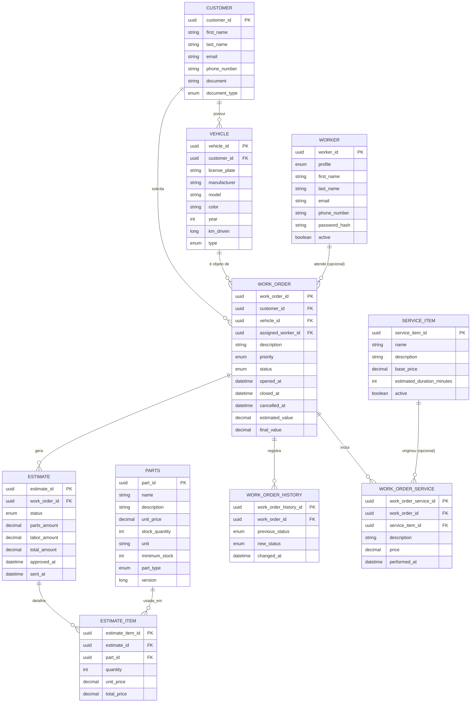

# Modelo Relacional — Oficina Mecânica

Modelo extraído das entidades JPA do projeto (schema `oficina_mecanica`, tabelas geradas via Hibernate `ddl-auto`).

> Observação: a tabela `app_users` existente em `db/init.sql` é uma tabela legada de seed/autenticação, sem entidade JPA correspondente — não faz parte do modelo de domínio abaixo.

## Diagrama ER (Mermaid)

## Entidades isoladas (sem FK no modelo JPA atual)
Nenhuma — todas as entidades possuem ao menos um relacionamento.

## Enums utilizados
| Enum | Valores |
|---|---|
| `DocumentType` | CPF, CNPJ |
| `VehicleType` | CAR, MOTORCYCLE |
| `WorkerProfile` | MECHANIC, ATTENDANT |
| `PartType` | PART, SUPPLY |
| `WorkOrderPriority` | LOW, MEDIUM, HIGH, URGENT |
| `WorkOrderStatus` | RECEIVED, DIAGNOSIS, WAITING_APPROVAL, IN_PROGRESS, COMPLETED, DELIVERED |
| `EstimateStatus` | PENDING, APPROVED, REJECTED |

## Cardinalidades
- Customer (1) → (N) Vehicle
- Customer (1) → (N) WorkOrder
- Vehicle (1) → (N) WorkOrder
- Worker (1) → (N) WorkOrder (mecânico responsável, FK `assigned_worker_id` opcional/nullable)
- WorkOrder (1) → (N) Estimate
- WorkOrder (1) → (N) WorkOrderHistory
- WorkOrder (1) → (N) WorkOrderService
- ServiceItem (1) → (N) WorkOrderService (item de catálogo de origem, FK `service_item_id` opcional/nullable)
- Estimate (1) → (N) EstimateItem
- Part (1) → (N) EstimateItem

